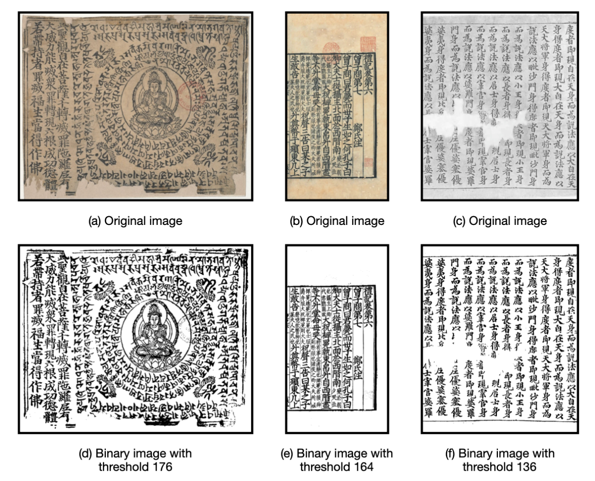
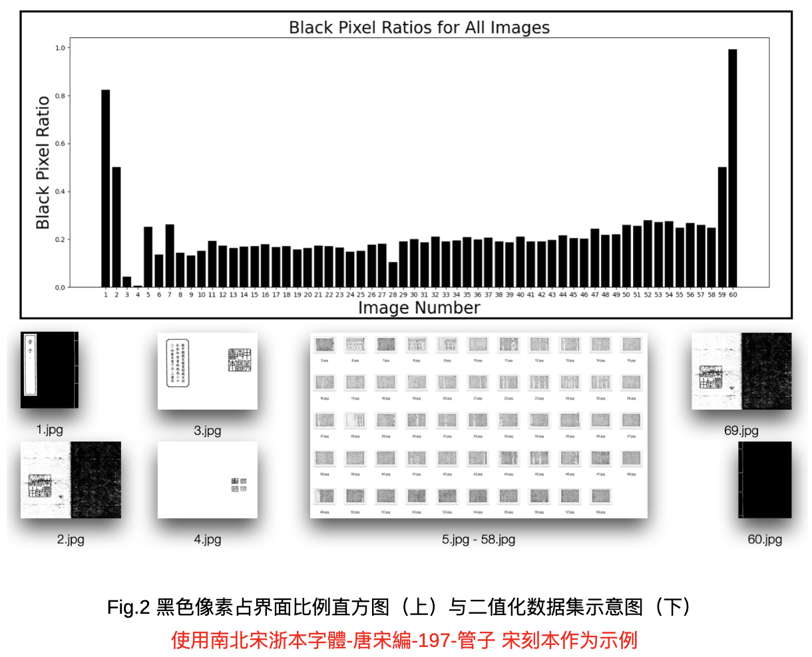

# Ancient-book-Edition-Identification

本repo用于古籍版本鉴定任务扫描书籍预处理，包括`二值化处理`，`副文本页面清除`，`书页边框裁切`以及`图像切块`四大步骤 。具体调用方式如下，或参照`test.py`

#### STEP 0 - 依赖项按安装
```
pip install -r requirements.txt
```

#### STEP 1 - 原始数据重命名
将原始数据集存储于本地路径后，调用`books_rename`函数可将指定路径下全部子文件夹下图像重命名为数字编号，以便于后续读取
```
from processing.rename import books_rename
books_rename(input_folder)
```

#### STEP 2 - 图像二值化
针对古籍受存储环境等影响导致的泛黄、破损、污迹等噪声问题，
`images_binarization`函数允许将扫描图像统一转换为灰度图像后，使用全局Otsu进行阈值选择并进行二值化的处理，将处理后图像存储在新文件夹下
```
from processing.otsu import images_binarization
images_binarization(input_folder, output_folder)
```

<center>Otsu阈值选择及二值化效果展示</center>

#### STEP 3 - 清除副文本
考虑到原始数据集中书页均为整本扫描。封面、前言、序跋等与本次版本鉴定的分类任务无关副文本被包含。因此，`books_remove_covers`函数支持对图像黑色像素占比进行统计，对于小于15%及大于35%（副文本）图像进行过滤，将过滤后图像存储在新文件夹下
```
from processing.remove_covers import books_remove_covers
books_remove_covers(input_folder, output_folder)
```

<center>副文本清除阈值确定（正文内容黑色像素占比通常在15%-35%之间）</center>

#### STEP 4 - 书页边框裁切
针对书页中存在的边框在切块后可能包含较少的文字信息，继而影响分类结果的现象，`images_crop_border`支持基于投影法，寻找半页中最长的黑线判定为边框进行裁切，将裁切后图像存储在新文件夹下
```
from processing.remove_bounders import images_crop_border
images_crop_border(input_folder, output_folder)
```

#### STEP 5 - 图像切块
参照神经网络input size对图像进行裁切，以增加数据量（299效果较好），将切块后图像存储在新文件夹下
```
from processing.chunking import images_chunking
images_chunking(input_folder, output_folder, chunk_size)
```

#### STEP 6 - 移除空白图块
对切块后的图像中存在的文字过少的chunks进行过滤，默认阈值为黑色像素占比小于8%为白块，将过滤后图像存储在新文件夹下
```
from processing.remove_blanks import chunks_remove_blanks
chunks_remove_blanks(input_folder, output_folder)
```
